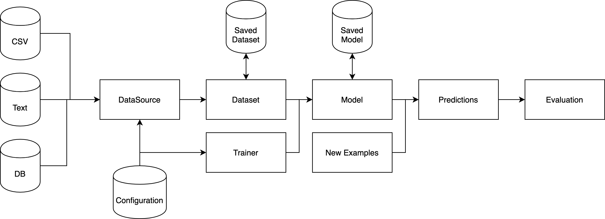

# Architecture

Tribuo is a library for creating Machine Learning (ML) models and for using
those models to make predictions on previously unseen data. 

A ML model is the result of applying some training algorithm to a dataset. Most
commonly, such algorithms produce output in the form of a large number of
floating point values; however, this output may take one of many different
forms, such as a tree-structured if/else statement. In Tribuo, a
model includes not only this output, but also the necessary feature and output
statistics to map from the named feature space into Tribuo's ids, and from
Tribuo's output ids into the named output space.

A Tribuo `Model` can also be thought of as a learned mapping from a *sparse*
feature space of doubles to a *dense* output space (e.g., of class label
probabilities, or regressed outputs etc). Every dimension of the input and
output are named. This naming system makes it possible to check that the input
and model agree on the feature space they are using.

## Data flow overview
<p align="center"></p>

Tribuo loads data using a `DataSource` implementation, which might load from a
location like a DB or a file on disk.  This DataSource processes the input
data, converting it into Tribuo's storage format, an `Example`. An Example is a
tuple of an `Output` (i.e., what you want to predict) and a list of Features,
where each `Feature` is a tuple of a `String` feature name and a `double`
feature value.  The DataSource is then read into a `Dataset`, which accumulates
statistics about the data for future use in model construction. Datasets can be
split into chunks to separate out training and testing data, or to filter out
examples according to some criterion. As Examples are fed into a Dataset, the
Features are observed and have their statistics recorded in a `FeatureMap`.
Similarly the Outputs are recorded in the appropriate `OutputInfo` subclass for
the specified Output subclass. Once the Dataset has been processed, it's passed
to a `Trainer`, which contains the training algorithm along with any necessary
parameter values (in ML these are called hyperparameters to differentiate them
from the learned model parameters), and the Trainer performs some iterations of
the training algorithm before producing the `Model`. A Model contains the
necessary learned parameters to make predictions along with a `Provenance`
object which records how the Model was constructed (e.g., data file name, data
hash, trainer hyperparameters, time stamp, etc).  Both Models and Datasets can
be serialized out to disk using Java Serialization. Once a model has been
trained, it can be fed previously unseen Examples to produce `Prediction`s of
their Outputs. If the new Examples have known Outputs, then the Predictions can
be passed to an `Evaluator`, which calculates statistics like the accuracy
(i.e.,  the number of times the predicted output was the same as the provided
output).

## Structure

Tribuo includes several top level modules:
- Core provides Tribuo's core classes and interfaces.
- Data provides loaders for text, sql and csv data, along with the columnar
  package which provides infrastructure for working with columnar data.
- Math provides Tribuo's linear algebra library, along with kernels and
  gradient optimizers.
- JSON provides a JSON data loader and a tool to strip provenance from trained
  models.

Tribuo has separate modules for each prediction task:
- Classification contains an `Output` implementation called `Label`, which
  represents a multi-class classification.  A `Label` is a tuple of a String
name, and a double precision score value. For each of `OutputFactory`,
`OutputInfo`, `Evaluator` and `Evaluation`, the Classification package includes
a classification-specific implementation, namely `LabelFactory`, `LabelInfo`,
`LabelEvaluator` and `LabelEvaluation`, respectively.
- Regression contains an `Output` implementation called `Regressor`, which
  represents multidimensional regression.  Each `Regressor` is a tuple of
dimension names, double precision dimension values, and double precision
dimension variances. It has companion implementations of `OutputFactory`,
`OutputInfo`, `Evaluator` and `Evaluation` called `RegressionFactory`,
`RegressionInfo`, `RegressionEvaluator` and `RegressionEvaluation`,
respectively. By default, the dimensions are named "DIM-x" where x is a
non-negative integer.
- AnomalyDetection contains an `Output` implementation called `Event`, which
  represents the detection of an anomalous or expected event (represented by
the `EventType` enum containing `ANOMALY` and `EXPECTED`). Each `Event` is a
tuple of an `EventType` instance and a double precision score value,
representing the score of the event type. The AnomalyDetection package has
companion implementations of `OutputFactory`, `OutputInfo`, `Evaluator` and
`Evaluation` called `AnomalyFactory`, `AnomalyInfo`, `AnomalyEvaluator` and
`AnomalyEvaluation`, respectively. 
- Clustering contains an `Output` implementation called `ClusterID`, which
  represents the cluster id number assigned.  Each `ClusterID` is a
non-negative integer id number and a double precision score representing the
strength of association.  The Clustering package has companion implementations
of `OutputFactory`, `OutputInfo`, `Evaluator` and `Evaluation` called
`ClusteringFactory`, `ClusteringInfo`, `ClusteringEvaluator` and
`ClusteringEvaluation`, respectively.
- MultiLabel contains an `Output` implementation called `MultiLabel`, which
  represents a multi-label classification.  Each `MultiLabel` is a possibly
empty set of `Label` instances with their associated scores.  The MultiLabel
package has companion implementations of `OutputFactory`, `OutputInfo`,
`Evaluator` and `Evaluation` called `MultiLabelFactory`, `MultiLabelInfo`,
`MultiLabelEvaluator` and `MultiLabelEvaluation`, respectively. It also has a
`Trainer<MultiLabel>` which accepts a `Trainer<Label>` and generates a
`Model<MultiLabel>` by using the inner trainer to make independent predictions
for each `Label`. This is a reasonable baseline strategy to use for multi-label
problems.

Finally, there are cross-cutting module collections:
- Common provides shared infrastructure for the prediction tasks.
- Interop provides infrastructure for working with large external libraries
  like TensorFlow and ONNX Runtime.
- Util provides independent libraries that Tribuo uses for specific tasks. For
  example, InformationTheory is a library of information theoretic functions,
and Tokens provides the interface Tribuo uses for tokenization along with
implementations of several tokenizers.

## Configuration, Options and Provenance

Many of Tribuo's trainers, datasources and other classes implement the
`Configurable` interface. This is provided by
[OLCUT](https://github.com/oracle/olcut), and allows for runtime configuration
of classes based on configuration files written in a variety of formats. The
default format is xml. Other available formats include JSON, protobuf & edn.

The configuration system is integrated into the command line arguments
`Options` system build into OLCUT's `ConfigurationManager`. Values in
configuration files can be overridden on the command line by supplying
`--@<object-name>.<field-name> <value>` in the arguments. The configuration
system provides the basis of Tribuo's model tracking `Provenance` system, which
records all hyperparameters, dataset parameters (e.g., file location, train/test
split, etc.), and any user-supplied instance information, along with run
specific information such as the file hash, number of training examples, etc.
A model provenance can be converted into a list of configurations for each
`Configurable` object involved in the model training. Similarly, an evaluation
provenance can be converted into the configurations for the model as well as
the configurations for the test dataset. These configurations can be loaded
into a fresh `ConfigurationManager` and optionally saved to disk. The
evaluation or model training can then be repeated or rerun with tweaks like new
data or a hyperparameter change.

Configurable classes have `@Config` annotations on their fields, and such
fields have the value from the configuration file inserted into them upon
construction in the configuration system. A snippet from the classification SGD
trainer is given below to illustrate this:

```java
public class LinearSGDTrainer implements Trainer<Label>, WeightedExamples {
    @Config(description="The classification objective function to use.")
    private LabelObjective objective = new LogMulticlass();

    @Config(description="The gradient optimiser to use.")
    private StochasticGradientOptimiser optimiser = new AdaGrad(1.0,0.1);

    @Config(description="The number of gradient descent epochs.")
    private int epochs = 5;

    @Config(description="Log values after this many updates.")
    private int loggingInterval = -1;

    @Config(description="Minibatch size in SGD.")
    private int minibatchSize = 1;

    @Config(description="Seed for the RNG used to shuffle elements.")
    private long seed = Trainer.DEFAULT_SEED;

    @Config(description="Shuffle the data before each epoch. Only turn off for debugging.")
    private boolean shuffle = true;

    private SplittableRandom rng;

    private int trainInvocationCounter;
}
```

Only fields which are configured need to be annotated `@Config`. Other fields
can be set in the appropriate constructor.  OLCUT requires that all classes
which implement `Configurable` have a no-args constructor. The `Configurable`
interface allows for a `postConfig` method, which is called after the object
has been constructed and the appropriate field values inserted, but before it
is published or returned from the `ConfigurationManager`. This `postConfig`
method is used to perform the validation that would normally be performed in a
constructor, and it can be called from regular constructors.  Default values
for the configurable parameters can be specified in the same way default fields
are usually specified. The `@Config` annotation has optional parameters for
supplying the description, declaring whether the field is mandatory, and
determining whether the field value should be redacted from any configuration
or provenance based on this object. More details about OLCUT can be found in
its [documentation](https://github.com/oracle/OLCUT).

The `LinearSGDTrainer` class above is configured by the xml snippet below:

```xml
<config> 
   <component name="logistic" type="org.tribuo.classification.sgd.linear.LinearSGDTrainer">
        <property name="objective" value="log"/>
        <property name="optimiser" value="adam"/>
        <property name="epochs" value="10"/>
        <property name="loggingInterval" value="100"/>
        <property name="minibatchSize" value="1"/>
        <property name="seed" value="1"/>
    </component>
    <component name="log" type="org.tribuo.classification.sgd.objectives.LogMulticlass"/>
    <component name="adam" type="org.tribuo.math.optimisers.Adam">
        <property name="initialLearningRate" value="3e-4"/>
        <property name="betaOne" value="0.95"/>
    </component>
</config>
```

This instantiates a `LinearSGDTrainer` with a logistic regression objective and
an `Adam` gradient optimiser, using [Andrei Karpathy's preferred
learning rate](https://twitter.com/karpathy/status/801621764144971776) and an
adjusted beta one parameter (note these parameters are just demonstration
values, we're not recommending these specific values).

As configuration is part of the class file rather than the public documented API
(because it operates on private fields), OLCUT ships with a CLI utility for 
inspecting a configurable class and generating an example configuration in any 
supported configuration format. To use this utility from the command line you 
can run:
```shell
$ java -cp <path-to-jars-including-olcut-core> com.oracle.labs.mlrg.olcut.config.DescribeConfigurable -n <class-name> -o -e xml
```
where the `-n` argument denotes what class to describe, `-o` denotes that an 
example configuration should be generated, and `-e` gives the file format to 
emit the example configuration in.

For example, running `DescribeConfigurable` on `LinearSGDTrainer` gives:
```shell
$ java -cp <path-to-tribuo-jars> com.oracle.labs.mlrg.olcut.config.DescribeConfigurable -n org.tribuo.classification.sgd.linear.LinearSGDTrainer -o -e xml
```
```
Class: org.tribuo.classification.sgd.linear.LinearSGDTrainer

Field Name      Type                                         Mandatory Redact Default                                                       Description
epochs          int                                          false     false  5                                                             The number of gradient descent epochs.
loggingInterval int                                          false     false  -1                                                            Log values after this many updates.
minibatchSize   int                                          false     false  1                                                             Minibatch size in SGD.
objective       org.tribuo.classification.sgd.LabelObjective false     false  LogMulticlass                                                 The classification objective function to use.
optimiser       org.tribuo.math.StochasticGradientOptimiser  false     false  AdaGrad(initialLearningRate=1.0,epsilon=0.1,initialValue=0.0) The gradient optimiser to use.
seed            long                                         false     false  12345                                                         Seed for the RNG used to shuffle elements.
shuffle         boolean                                      false     false  true                                                          Shuffle the data before each epoch. Only turn off for debugging.

Example :
<?xml version="1.0" encoding="utf-8"?>
<!--OLCUT configuration file-->
<config>
<component name="example" type="org.tribuo.classification.sgd.linear.LinearSGDTrainer" export="false" import="false">
	<property name="seed" value="0"/>
	<property name="minibatchSize" value="0"/>
	<property name="shuffle" value="false"/>
	<property name="epochs" value="0"/>
	<property name="optimiser" value="StochasticGradientOptimiser-instance"/>
	<property name="loggingInterval" value="0"/>
	<property name="objective" value="LabelObjective-instance"/>
</component>
</config>
```

It's also possible to access this information programmatically, but there are
several ways of doing that in OLCUT each appropriate to different use cases.


## Data Loading

### Built-in formats

Tribuo supports several common input formats for loading in data:
- libsvm/svmlight - a sparse numerical format for classification and regression
  tasks.
- IDX - a dense multidimensional numerical format for classification and 
  regression. Tribuo will transparently decompress gzipped idx files as they are
read.
- CSV - a plain text delimited format (using an RFC4180 compliant parser).
- JSON - JavaScript Object Notation. Tribuo natively reads JSON objects, which
  are a map from String to primitive value. The whole file is an array of such
objects.
- SQL - Tribuo has a JDBC loader, which can query a database and convert the
  result set into Tribuo `Example`s.
- text - a one document per line format in which with the response variable
  before the text is delimited by ` ## `.

There are two CSV loaders:  A simple one for reading a CSV file (with or
without a header) where all the columns are either features or responses, and a
complex loader based on Tribuo's `RowProcessor`. The `RowProcessor` also
underlies the SQL and JSON loaders, and is extremely configurable. From v4.2
the simple `CSVLoader` wraps a `RowProcessor` to allow simple upgrading as the
CSVs become more complicated. For more details see the [Columnar
Inputs](#columnar-inputs) section below or look at the 
[columnar data tutorial](https://github.com/oracle/tribuo/blob/main/tutorials/columnar-tribuo-v4.ipynb).
If there are other common formats of interest, let us know by filing an issue.

Tribuo's interfaces are extensible, and implementing another format simply
requires implementing the `DataSource` interface. We recommend using
`LibSVMDataSource` or `TextDataSource` as examples of how to implement a flat
file format. For columnar data, Tribuo has specialised processing
infrastructure. This is used for the CSV, JSON and SQL loaders, and it provides
a large amount of flexibility.

### Columnar Inputs

Columnar data sources require a configurable extraction step to map the columns
into Tribuo `Example` and `Feature` objects. A single column may contain
multiple features, may be extraneous, or may contain `Example`-level metadata.
In addition, the user must specify which column(s) contain the output variable.
To support this usecase, Tribuo provides the `RowProcessor`, a configurable
mechanism for converting a `ColumnarIterator.Row` (which is a tuple of a
`Map<String,String>` and a row number) into an `Example`. The `RowProcessor`
uses four interfaces to process the input map:
- `FieldExtractor` - processes the whole row at once, extracting metadata
  fields. These extracted fields, such as an `Example`'s id number, are then
written into the `Example`. As described in the javadoc, the `Example`'s weight
is handled as a special case of the metadata processing.
- `FieldProcessor` - processes a single field to produce a (possibly empty)
  list of `Feature`s.
- `FeatureProcessor` - processes all the features after they have been
  generated by a `FieldProcessor`. This allows for the generation of features
that depend upon multiple other features, such as conjunctions. It also
facilitates the filtering out of irrelevant, unnecessary or duplicated features.
- `ResponseProcessor` - processes the designated response fields using the
  supplied `OutputFactory` to convert the field text into an `Output` instance.

These interfaces are supplied to the `RowProcessor` on construction (or
configuration). By default, `FieldProcessor`s are bound to a single column, but
there is an optional system which generates new `FieldProcessor`s based on
supplied regexes. This system can be used if the data is drawn from a
schema-less format where the presence of fields in particular documents is not
known in advance by the user.  The regex system is also useful when the set of
fields is large and the number of unique `FieldProcessor`s is small.  For
example, the same field processor can be applied to all columns whose name
begins with "A", thus avoiding the need to write a large configuration or code
file to describe all such columns. Although these regexes are usually
instantiated once, before any rows are processed, `RowProcessor` is
intentionally subclass-able so that developers can trigger expansion whenever
necessary. In the current implementation, there is at most one `FieldProcessor`
per field; we'll reconsider this restriction if there is sufficient interest.

Internally, the `RowProcessor` operates on `ColumnarFeature`, which is a
feature subclass that tracks both the feature name and the column name. It's
used to allow additional flexibility in the `FeatureProcessor`s when generating
conjunction or other cross-cutting features. `ColumnarFeature`s should not be
depended on when outside the columnar processing infrastructure since the
`Example` contract does not guarantee that feature objects are preserved after
being stored in an `Example`.

If your columnar data is not in a format currently supported by Tribuo, you can
subclass `ColumnarDataSource`, provide an implementation of `ColumnarIterator`,
which converts from your input format into `ColumnarIterator.Row`, and then
configure the `RowProcessor` to extract `Example`s from your data.

### Splitting up Datasets

`DataSource`s are not designed for splitting data into chunks; however, Tribuo
provides several other mechanisms for splitting data into training and test
sets, subsampling data based on its properties, and creating cross-validation
folds. The train/test and cross-validation splits are self-explanatory, though
it's worth noting that the cross-validation splits use the feature domain of
the entire, underlying dataset. The `DatasetView` underlies the
cross-validation splits and can also be constructed using a predicate function
(or a list of indices). The predicate function accepts an `Example` and thus
can depend on the features, outputs or metadata encoded in an `Example`.

## Transforming datasets

Tribuo supports independent, feature-based transformations including the
rescaling or binning of features. These feature transformations can be found in
the `org.tribuo.transform` package, which provides the mechanisms for fitting
and applying transformations. Transformations can be chained to create
pipelines that are applied in the supplied sequence to the specified
feature(s). Local transformation pipelines are those that are applied only to
the given named feature(s), whereas global transformations pipelines are
applied after local pipelines and apply to every feature. Local transformations
pipelines can also be applied to features which match a regular expression 
(regex). Specifically, every feature name which matches the regex receives a 
copy of that transformation pipeline, and that pipeline is then applied to the
feature.  An exception will be thrown if an attempt is made to apply a regex 
transformation pipeline to a feature that has already received a local 
transformation pipeline. Additionally, all transformations are applied to the 
feature domain to ensure it maintains the proper statistics.

Currently, transformations must be based on only a single feature at a time,
but we plan to introduce global feature transformations in some future release
to allow operations over the whole feature space such as PCA.

## Weights and Metadata

Examples can have metadata attached to them, and this metadata can be used to
filter out Examples or otherwise tag them for special processing. The metadata
takes the form of a `Map<String,String>`, which can only be appended to; the
values cannot be modified after insertion. In addition, each Example has a
float-valued weight field, which can be used to denote the importance of an
Example in a training or evaluation setting. Only training algorithms that
implement the `WeightedExamples` tag interface support weighted examples;
otherwise the example weights are ignored. The weight field is currently
supported in the `RegressionEvaluator` if the weighted evaluation flag is
turned on. We'll consider adding this support to the other evaluators, although
it may require breaking API changes since the return types of some accessor
methods could change from integer to floating point values.

## Obfuscation

One of Tribuo's benefits is its extensive tracking of model metadata and
provenance; however, we realise this metadata isn't necessarily something that
should live in third-party accessible, deployed models. As a result, Tribuo
provides a few transformation mechanisms to remove metadata from a trained
model.

### Provenance

Provenance can be removed from `Model` objects using the `StripProvenance`
program located in the JSON module. There are three kinds of stored provenance:
trainer provenance, data provenance, and instance provenance. Each type of
provenance can be removed separately. It is also possible to insert a SHA-256
hash of the full provenance object into the model as a tracking mechanism. We
intend for the user to store the hash as a key for the original provenance JSON
in an external storage mechanism. Alternatively, `@Config` fields can be marked
`redact=True` which will prevent those values from being stored in the
provenance or any configuration.

### Feature Hashing

In addition to its use as a dimensionality reduction technique, feature hashing
also obfuscates the original feature names in cases where the forward mapping
from original names to hashed names has not been stored by the system. So as to
avoid the storage of such a forward mapping, Tribuo provides an implementation
of feature hashing that lives entirely in the feature domain object. This means
that Tribuo has no knowledge of the true feature names, and the system
transparently hashes the inputs. The feature names tend to be particularly
sensitive when working with NLP problems. For example, without such hashing,
bigrams would appear in the feature domains.

## Serialization

Tribuo supports Java serialization (i.e., using `java.io.Serializable`) and from
v4.3 it supports serializing objects to protobufs. Java serialization support is
deprecated, and will be removed in the next major version. While using the Java 
serialization support we recommend the use of a serialization filter, more 
information is given in our [Security documentation](Security.md).
Classes which support protobuf serialization
now implement `ProtoSerializable<T>` where the type bound gives the type of the protobuf they
serialize to. Tribuo's protobuf serialization supports
all the types that Java serialization supports, with the exception of `Example`
metadata values which previously supported any `java.io.Serializable` type, and now
only support `String` values. Helper methods to deserialize objects from protobufs
have been added to all the major interfaces of the form `<interface-name>.deserialize(<interface-name>Proto)`
The protobuf definitions are packaged into Tribuo's jars, and the protobuf classes
are compiled using protoc `v3.19.4`. Tribuo's protobuf support includes versioning
of the protobufs to allow incremental modifications to the protobuf schemas as the
types evolve. This flexibility should allow protobuf to remain the preferred serialization
format for Tribuo without restricting the evolution of Tribuo's classes and interfaces.

As Java's generic type system is erased, the objects returned from this serialization
mechanism internally validate that the types are consistent, but users must validate
that the `Model` is of the expected type using 
`Model.validate(Class<? extends Output<?>>)` or similar.

## ONNX Export

From v4.2 Tribuo supports exporting some models in the [ONNX](https://onnx.ai)
model format. The ONNX format is a cross-platform model exchange format which
can be loaded in by many machine learning libraries. Tribuo supports
inference on ONNX models via ONNX Runtime. Models which can be exported
implement the `ONNXExportable` interface, which provides methods for
constructing the ONNX protobuf and serializing it to disk. As of the release of
4.2, a subset of Tribuo's models are supported: linear models, sparse linear
models, LibSVM models, factorization machines, and ensembles thereof. We plan
to expand the set of exportable models in future releases. It is unlikely that
Tribuo will support direct ONNX export of TensorFlow models, however this can
be achieved by saving the Tribuo trained model in TensorFlow Saved Model
format, and then using the Python
[tf2onnx](https://github.com/onnx/tensorflow-onnx) project to convert that into
an onnx file.

### ONNX and provenance

Tribuo-exported ONNX files contain the Tribuo model provenance, stored as a 
protobuf in the metadata field "TRIBUO\_PROVENANCE". If the model is loaded
back into Tribuo via ONNX Runtime, then the model provenance can be recovered
from the file, allowing the reproducibility system and the model tracking
features to work.

### ONNX and deployment

The ONNX format is widely supported in industry and across cloud providers.
Many hardware accelerators and edge computing vendors provide ONNX support for
their inference platforms, and this allows Tribuo-trained models to be widely
deployed after they have been exported. Tribuo provides an interface to [OCI
Data Science Model
Deployment](https://docs.oracle.com/en-us/iaas/data-science/using/model-dep-about.htm)
which deploys an ONNX model on [Oracle Cloud](https://www.oracle.com/cloud/),
and also can wrap a model deployment REST endpoint so it appears as a Tribuo
Model, allowing cloud deployment and inference from Tribuo. ONNX models are
also supported by [Oracle Machine Learning
Services](https://docs.oracle.com/en/database/oracle/machine-learning/omlss/index.html),
and many other cloud providers also provide ONNX model inference services which
can be used with exported Tribuo ONNX models.

## Reproducibility

From v4.2 Tribuo has a built-in reproducibility system for non-sequence Models.
This accepts a `Model` or `ModelProvenance` instance, automatically extracts
the configuration from the instance and then retrains the model, using the
data loading pipeline and training hyperparameters specified in the model provenance.
The system produces a diff of the reproduced model's provenance against the
original provenance, highlighting areas where the new model may behave differently
to the old one (e.g., showing if the number of features differs, or if the data
files have changed).

This is useful to check the validity of deployed production models, and to allow
easy comparison between a production model and one trained on current data. Over
time we plan to expand this system to support experimenting with different model
hyperparameters and training data configurations, tracking all this information
using the provenance built into Tribuo.

The reproducibility system requires Java 17, and as such is not included in the
`tribuo-all` Maven Central target. It is designed to be used in a development
environment rather than deployed in a production system like the rest of
Tribuo.  As Tribuo migrates to newer versions of Java, we will consider
providing a jlink'd version of this utility.
